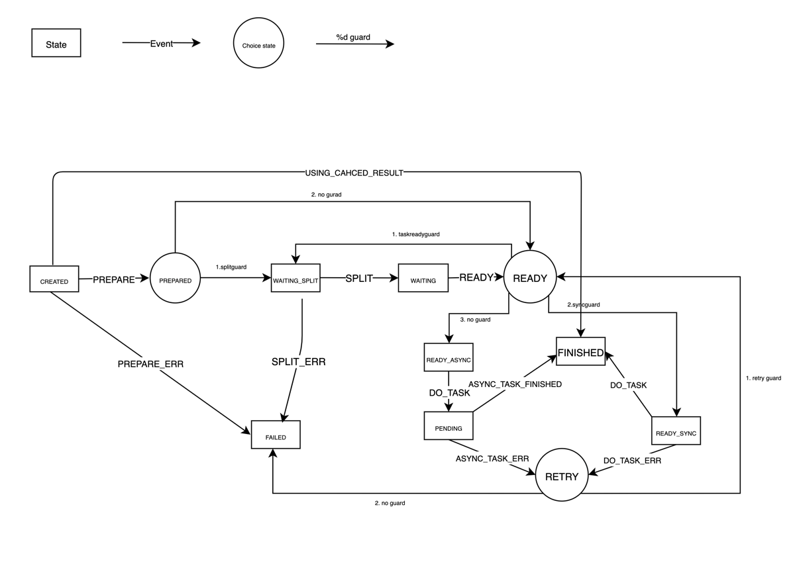

# StateMachine with leveled tasks

## state graph

## pros
1. Tasks are leveled and can be further leveled with flexibility

2. Tasks can be cancelled and the state can propagate to desired levels

3. Sibling tasks can be configured to depend on the other sibling tasks finished first

4. Flexible exception handling and retry by just setting the state

5. Pickup cached result easily, avoid repeated work(some persistency needed as well)

6. Configured behavior for early failure

## cons
1. hard to introduce other structure not fitting in with the current design
2. introduced an extra layer of code and extra delegation of third-party

## todos
1. Upgrade spring state machine to 3.0.X (breaking changes)
2. Combine Task and State Machine together by using context integration(https://docs.spring.io/spring-statemachine/docs/current/reference/index.html#sm-context)
3. time out by timer (https://docs.spring.io/spring-statemachine/docs/current/reference/index.html#using-timertrigger)